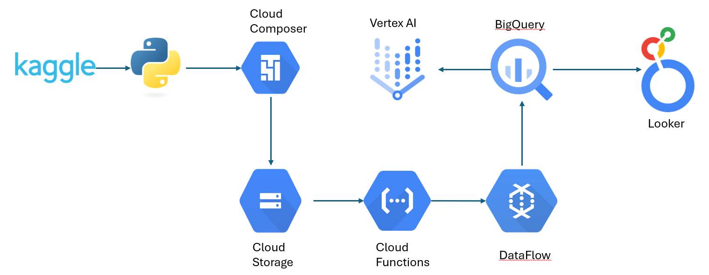

# Rossmann Store Sales Forecasting

## Overview
This repository contains a comprehensive analysis and machine learning pipeline for forecasting daily sales for Rossmann stores. The project leverages historical sales data to predict future trends, providing valuable insights to optimize business operations and decision-making.



<i>Initially, I required kaggle.josn file and so I created another task in DAG and it transferrd the kaggle.json file to the cloud storage but then I removed it as it was giving error regarding the file already exists.</i>

## Table of Contents
- [Problem Statement](#problem-statement)
- [Dataset](#dataset)
- [Approach](#approach)
- [Results](#results)
- [Usage](#usage)

## Problem Statement
Rossmann operates over 3,000 drug stores in Europe. Managers are tasked with predicting daily sales for up to six weeks in advance, accounting for factors such as:
- Promotions
- Holidays (school and state)
- Seasonality
- Competition

The objective is to accurately forecast sales using historical data, enabling better resource allocation and strategic planning.

## Dataset
The dataset used for this project includes:
- **Train.csv**: Historical data with sales information
- **Test.csv**: Historical data without sales for prediction
- **Store.csv**: Supplemental store information

Key features include:
- `Sales`: Daily turnover (target variable)
- `Customers`: Number of customers visiting
- `Promo`: Whether a promotion was active
- `CompetitionDistance`: Distance to the nearest competitor store
- `StateHoliday` & `SchoolHoliday`: Indicators for holidays
- And more!

For more details, visit the dataset source on [Kaggle](https://www.kaggle.com/c/rossmann-store-sales/data).

<i>Note: The purpose of this project is to demonstrate the end-to-end machine learning pipeline using Google Cloud and not gaining a good performance on the model and thus we would not be using the `Store.csv` file.<i>

## Approach
The project follows the CRISP-DM methodology:
1. **Business Understanding**: Define the problem and stakeholders.
2. **Data Understanding**: Explore dataset structure and relationships.
3. **Data Preparation**: Clean, transform, and enrich data.
4. **Modeling**: Build predictive models using machine learning techniques.
5. **Evaluation**: Assess model performance with metrics like RMSE.
<!-- 6. **Deployment**: Deploy the model for practical use. -->

### Models Utilized
- **XGBoost**: XGBoost (Extreme Gradient Boosting) is a scalable, high-performance machine learning library designed for gradient boosting that excels in structured/tabular data prediction tasks.

### Visualization
The analysis includes insightful visualizations like bar charts, heatmaps, and scatter plots for EDA.

## Results
- **Model Accuracy**: Achieved a competitive RMSE score on the validation dataset.
- **Insights**: Identified key drivers of sales, such as promotions and competitor distance.

## Usage
1. Clone the repository:
   ```bash
   git clone https://github.com/sarthakforwet/Rossman_Store_Sales.git

